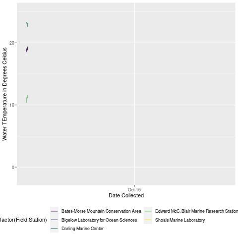

### Executive Summary

We received two datasets from the Northeastern Coastal Station Alliance (NeCSA) relating to trends in temperature and biological diversity over the course of 24 and 13 month periods, respectively. NeCSA consists of ten small coastal stations along the gulf of Maine. The bulk of our initial work consisted of cleaning and adjusting the data so that we could analyze and create visualizations for it. We fixed typos in the entries, the date formatting, and we have some suggestions for more efficient protocols for future data collection so that the datasets will be easier to work with in a technical setting. For example, in the biological diversity dataframe, there were several variables related to the abundance of certain crab species within a quadrat or along a transect. The values for these variables were sometimes recorded as zeroes, sometimes left blank, and sometimes as ‘NA’. Following a stricter protocol for the collection of this data will enable a much easier analysis later. For the temperature dataset, we also created an RShiny App that incorporates an interactive graph and allows the user to remove outliers and manipulate the dataset and graph according to the user's wishes. Then, we created several sets of graphs that illustrate the data in new and illuminating but still accessible ways. Trends in temperature and crab populations can be studied visually, and with more data, these visualizations will show long-term trends quite clearly.
	

```{r setup, include=FALSE}
knitr::opts_chunk$set(echo = TRUE)
```


```{r, message=FALSE, echo=FALSE}
# Load the libraries and install packages
library(tidyverse)
library(ggplot2)
library(gganimate)
library(dplyr)
library(gifski)
library(readr)
library(leaflet)
library(viridis)
library(lubridate)
```


```{r, echo=FALSE}
# read the data from GitHub

transectDf <- read.csv(url("https://raw.githubusercontent.com/LaurieLBaker/NeSCA-Field-Stations/main/data/NeCSA_data_template_Test_Horizontal_Transect_Data.csv"))

tempDf <- read.csv(url("https://raw.githubusercontent.com/LaurieLBaker/NeSCA-Field-Stations/main/data/NeCSA_data_template_Temperature_Data.csv"))
```

```{r, echo=FALSE}
waterTemps = tempDf$Water.Temperature
for(i in 1:(nrow(tempDf))){
  tempDf$TempDiff[i] = abs(waterTemps[i+1] - waterTemps[i])
}

#edit the tempDiff column to round each of the numbers in the column to two decimal places
tempDf$TempDiff <- round(tempDf$TempDiff, digit=2)
```

```{r field-stations-leaflet, echo = FALSE}
# Create df for field station locations
FieldStationDf <- tempDf %>%
  group_by(`Field.Station`) %>%
  select(`Field.Station`, Longitude, Latitude) %>%
  distinct()
# Create labels for leaflet
labels <- sprintf(
  "<strong>%s</strong><br/>",
    FieldStationDf$`Field.Station` %>%
      lapply(htmltools::HTML)) 
# Generate Gulf of Maine leaflet indicating location of each field station
leaflet(FieldStationDf) %>%
  addTiles() %>%
  addProviderTiles(providers$Esri.OceanBasemap) %>%
  addMarkers(~Longitude, ~Latitude, popup = labels) %>%
    setView(lng = -69, lat = 43.7, zoom = 7.5) 
```


```{r, echo=FALSE}
# Reformat the date column to be yyyy-mm-dd
tempDf$Date = lubridate::mdy(tempDf$Date)
```

### Introduction

Since 2004, sea surface temperatures in the Gulf of Maine have increased faster than 99% of all oceans. This had led to shifts in the presence of various marine species such as invasive crabs. Longer periods of warm temps allow predators to forage for longer, altering ecosystems and stressing marine organisms
NeCSA, Manomet, and other organizations have been monitoring on-shore temperatures around the coast of Maine through citizen science efforts (Hinkley, 2021).

### Data Background

All of our water temperatures are recorded in the intertidal zone, where thermometers are prone to tide changes. This means that some data points were recorded when the thermometer was exposed to air, which we want to exclude in some of our analyses. Besides, the data is collected by volunteers at various sites around the Gulf of Maine. In this project, we aimed to make this data more accessible to the people that collect it, and to clarify it for people who will be working with it in the future.

We read our raw data from the GitHub respitory provided by Professor Laurie Baker. According to our dataset, there are 3 different sites where the transect and species data was collected: "Edward McC. Blair Marine Research Station (MDR)", "Schoodic Institute at Acadia National Park", and "Shoals Marine Laboratory". Besides, there are 6 different sites where the temperature data was collected: "Shoals Marine Laboratory","Edward McC. Blair Marine Research Station (MDR)", "Darling Marine Center", "Schoodic Institute at Acadia National Park", "Bates-Morse Mountain Conservation Area", and "Bigelow Laboratory for Ocean Sciences".

### Methodological Approach and Graphic Results

### Temperature Data

#### Cleansing data

Before we performed our analysis and visualization, we spent time understanding our data and thinking about what to do to make our project most beneficial for the large research group. In the temperature data, which is relatively straightforward and can be easily understood, we simply converted the date column to another format that can be used in our visualization and analysis, and we removed the time column since it is NA for all rows. Additionally, we received help from our community partner to figure out the difference among 0, NA's, and ND's though we did not greatly use them in out further computation and evaluation. 

```{r, echo=FALSE, eval=FALSE}

# cleansing data

urlfile="https://raw.githubusercontent.com/LaurieLBaker/NeSCA-Field-Stations/main/data/NeCSA_data_template_Horizontal_Transect_Data.csv"

mydata<-read.csv(url(urlfile))

# Removing the time column since it is NA for all rows
data1 <- subset(mydata, select = -Time) 

# The next step here is to find the difference between 0, NA, and blank for the last few columns.
summary(data1) # generating summary statistics for the data 

# Cleaning the data

data2<-data1[(data1$Species.Code=="AscoCC" | data1$Species.Code=="ChonCrSC"),]
data2<- data2[-12]

data2$Canopy.cover..0.25.[is.na(data2$Canopy.cover..0.25.)] <- ""
data2$Substrate.Cover[is.na(data2$Substrate.Cover)] <- ""

data2$Species.Count <- paste(data2$Canopy.cover..0.25., data2$Substrate.Cover)
```
 
```{r, echo=FALSE, message=FALSE}
# Import the temperature data from a github repository

urlfile="https://raw.githubusercontent.com/LaurieLBaker/NeSCA-Field-Stations/main/data/NeCSA_data_template_Temperature_Data.csv"

tempdata<-read.csv(url(urlfile))

tempdata <- subset(tempdata, select = -Data.Collection.Site)

#summary(tempdata) # generating summary statistics for the temperature data 
```


#### Visualize water temperature

Even though Matt Clayton'23 has already created a great plot in visualizing all water temperature data in each station, we made some alternative plots to explore how the temperature is distributed throughout the years when the data was being collected. In our visualization, we discovered several approaches in which we decided to further analyze our data.

##### Overall water temperature distribution from 2016 to 2018 in all stations
```{r, warning=FALSE, echo=FALSE}
ggplot(data=tempdata, aes(x=Date, y=Water.Temperature, group=Field.Station)) +
  geom_line()+
  geom_point()
```


```{r, echo=FALSE}
tempdata <- tempdata %>% 
  mutate(tempdiff = c(NA, tempdata$Water.Temperature[2:nrow(tempdata)] - tempdata$Water.Temperature[1:(nrow(tempdata)-1)]))

```


##### The temperature data just for the Shoals Marine Lab 
```{r, echo=FALSE}
shoalstemp <- tempdata[1:9131,]

tempdata$Date = lubridate::mdy(tempdata$Date)

ggplot(shoalstemp,aes(x=Date, y=Water.Temperature))+geom_line()

```

##### Ring plot for water temperature sorted by stations
```{r temp-vs-time-by-facility-faceted, echo = FALSE}
# Create faceted line plot of water temperature by field station over time
tempDf %>%
  filter(year(Date) == 2016) %>%
  ggplot(mapping = aes(x = Date, 
                       y = `Water.Temperature`,
                       color = `Field.Station`)) +
  geom_line(show.legend = FALSE) +
  facet_wrap(~ `Field.Station`, ncol = 5) +
  labs(title = "Recorded Water Temperature Over Time",
       subtitle = "Faceted By NeCSA Field Station",
       y = "Water Temperature (Celsius)",
       x = "Date") +
  scale_x_date(date_breaks = "3 months" , date_labels = "%b-%y") +
  guides(x =  guide_axis(angle = 30)) +
  coord_polar()
```


#### Finding and plotting the difference of water temperature

After visualizing the temperature in a ring plot, we started by simply taking the difference of two consecutive points in the temperature dataset and made a scattered plot, in which we found some significantly extreme outliers that has a difference of over 30 degree celsius. Biologically, it is unreasonable for ocean water to increase or decrease its temperature by such amount in an hour. As a result, it is necessary to eliminate these outliers and filter out the reasonable water temperature for further analysis. 

##### Scattered plot of the temperature difference data

```{r, warning=FALSE, echo=FALSE}
ggplot(tempDf, aes(x=Date, y=TempDiff)) + geom_point(size = 1)+ ggtitle("Hourly Difference in Temperature Recordings ") +
  xlab("Date") + ylab("Temperature Difference in degrees Celcius")

ggplot(tempDf, aes(x=Date, y=Water.Temperature, color = Field.Station)) + geom_point(size = 0.5)+ ggtitle("Hourly Recorded Temperature in degrees Celcius Including Outliers") +
  xlab("Date") + ylab("Temperature in degrees Celcius")
```

```{r, echo=FALSE}

#outliers <- tempDf$Water.Temperature[tempDf$Water.Temperature > 25 | tempDf$Water.Temperature < 0 ] 


#Create a dataframe that includes only the outlier data points -- points that are either above 25 degrees calcius or below 0 degrees celcius
tempOutliersDf <- subset(tempDf, Water.Temperature > 25 | Water.Temperature < 0, select=c(Field.Station, Date, Time, Water.Temperature)) 

#Create a dataframe that includes only the valid temperature data points
tempsValidDf <- subset(tempDf, Water.Temperature < 25 & Water.Temperature > 0, select=c(Field.Station, Date, Time, Water.Temperature)) 


```

##### Hourly difference in temperature at the different stations
```{r temp-range-by-facility, warning=FALSE, echo = FALSE}
tempDf %>%
  ggplot(mapping = aes(x = `Field.Station`, 
                       y = `TempDiff`,
                       fill = `Field.Station`)) +
  geom_violin() +
  labs(title = "Hourly Difference in Recorded Water Tempteratures",
       subtitle = "By NeCSA Field Station",
       y = "Water Temperature (Celsius)") +
  theme(legend.position = "bottom",
        axis.text.x = element_blank(),
        axis.ticks.x = element_blank(),
        axis.title.x = element_blank(),
        legend.title = element_blank()) +
  guides(fill = guide_legend(nrow=3))
  
```

#### Removing outliers of water temperature
In our scattered plot, we noticed that we might have included the temperature difference in different stations since all data is recorded on one sheet, so we made another plot which computed the differences in each station. Then, we noticed that the majority of our hourly water temperature differences are indeed less than 5 degree celsius, which makes biological sense and means that we only need to exclude a small number of data points from the dataset instead of taking off almost half of the records based on our first scattered boxplot. Without outliers, we can see how the water temperature is throughout different stations in a clearer view. On the other hand, we made visualizations specifically for outliers to see their range and distribution, and we also created an interactive application for the readers to determine their own desired range of water temperature and evaluate the corresponding distribution by using the R shiny app.

##### Our R shiny app can be accessed [here](https://laurie-the-student-baker.shinyapps.io/NeCSA_Temperature_Outliers/).


##### Boxplot to visualize outliers for temperature reading by site. 
```{r, echo=FALSE}
labels = c("Shoals", "MDR", "Darling", "Schoodic", "BMM", "Bigelow") # labling the x axis
boxplot(split(tempdata$Water.Temperature, tempdata$Field.Station), names=labels, col="blue", xlab="Field Station", ylab= "Temperature (C)")
```


##### Distribution of water temperature without the outliers
```{r temp-range-by-facility-2, echo = FALSE}
tempsValidDf %>%
  ggplot(mapping = aes(x = `Field.Station`, 
                       y = `Water.Temperature`,
                       fill = `Field.Station`)) +
  geom_violin() +
  labs(title = "Distribution of Recorded Water Temperatures Excluding Outliers",
       subtitle = "NeCSA Field Station",
       y = "Water Temperature (Celsius)") +
  theme(legend.position = "bottom",
        axis.text.x = element_blank(),
        axis.ticks.x = element_blank(),
        axis.title.x = element_blank(),
        legend.title = element_blank()) +
  guides(fill = guide_legend(nrow=3))
  
```

##### Water temperature distribution of the ouliers only 
```{r temp-range-by-facility-outlier, echo = FALSE}
tempOutliersDf %>%
  ggplot(mapping = aes(x = `Field.Station`, 
                       y = `Water.Temperature`,
                       fill = `Field.Station`)) +
  geom_violin() +
  labs(title = "Distribution of Recorded Water Temperatures Outliers",
       subtitle = "NeCSA Field Station",
       y = "Water Temperature (Celsius)") +
  theme(legend.position = "bottom",
        axis.text.x = element_blank(),
        axis.ticks.x = element_blank(),
        axis.title.x = element_blank(),
        legend.title = element_blank()) +
  guides(fill = guide_legend(nrow=3))
  
```

##### Plots of outliers in the form of temperature recordings
```{r, echo=FALSE}
ggplot(tempOutliersDf, aes(x=Date, y=Water.Temperature)) + geom_point()+ ggtitle("Hourly Difference in Temperature Recordings ") +
  xlab("Date") + ylab("Temperature Difference in degrees Celcius")
```

##### Line graph of outliers in each station
```{r, echo=FALSE}
p <- tempOutliersDf %>%
  filter(year(Date) == 2016, Field.Station %in% c("Darling Marine Center", "Shoals Marine Laboratory", "Bates-Morse Mountain Conservation Area", "Edward McC. Blair Marine Research Station (MDR)", "Schoodic Institute at Acadia National Park",  "Bigelow Laboratory for Ocean Sciences")) %>%
  ggplot(
  aes(Date, Water.Temperature, group = Field.Station, color = factor(Field.Station))
  ) +
  geom_line() +
  scale_color_viridis_d() +
  labs(x = "Date Collected", y = "Water Temperature in Degrees Celcius") +
  theme(legend.position = "bottom") + 
  scale_x_date(date_breaks = "1 months", date_labels = "%b-%y") +
  #facet_wrap(~Field.Station, ncol = 3) + 
  guides(color = guide_legend(nrow = 3))
p

```

#### Compute the daily running average of water temperature

Because of the large number of data points and potential outliers, we tried to balance out the temprature values for further exploration by evaluating the daily running average of water temperature. The running average was computed by taking the average of all temperature data recorded on the same day. Except for the first few rows, the rest of the dataset are all collected evenly, meaning that there are 24 data points within a day with no missing values. The completeness of our dataset made our coding much smoother in computing the running averages. Then, we made an animated graph so that we can visualize the trends of water temperature in each stations from a clearer prospective. In our animation, the temperature rises in summer and drops in winter, which makes biological sense. One point that is worth noting is that one of the stations, the Schoodic Institute at Acadia National Park, did not have any data in 2016 and only contained data for the later part of 2017.


```{r, echo=FALSE}
# compute the running average of water temperature
tempDf$dailyAverageTemp = NA_real_
tempAverageDf <- tempDf %>%
  select(Field.Station, Date, Time, Water.Temperature, dailyAverageTemp)

for(i in 17 : (nrow(tempAverageDf) - 27708)) {
  tempAverageDf$dailyAverageTemp[i] = (sum(tempAverageDf$Water.Temperature[i : (i + 23)])) / 24
}
  
```

##### Animated line graph for water temperature in different stations in 2016 
```{r,eval=FALSE, echo=FALSE} 
p <- tempAverageDf %>%
  filter(year(Date) == 2016, Field.Station %in% c("Darling Marine Center", "Shoals Marine Laboratory", "Bates-Morse Mountain Conservation Area", "Edward McC. Blair Marine Research Station (MDR)", "Schoodic Institute at Acadia National Park",  "Bigelow Laboratory for Ocean Sciences")) %>%
  ggplot(
  aes(Date, dailyAverageTemp, group = Field.Station, color = factor(Field.Station))
  ) +
  geom_line() +
  scale_color_viridis_d() +
  labs(x = "Date Collected", y = "Water TEmperature in Degrees Celcius") +
  theme(legend.position = "bottom") + 
  scale_x_date(date_breaks = "4 months", date_labels = "%b-%y") +
  #facet_wrap(~Field.Station, ncol = 3) + 
  transition_reveal(Date) +
  guides(color = guide_legend(nrow = 3))
p

animate(p, renderer = gifski_renderer())
anim_save("temp_anim.gif", anim = last_animation())
```



#### Heat map for water temperature

Lastly, we made a heat map to directly visualize the temperature distribution grouped by each station. According to our map, we can see where the data is missing as well as where the maximum and minimum temperature occurs. 

##### Overall heat map for water temperature in each station
```{r, echo=FALSE}
#q <- tempDf %>%
  #filter(year(Date) == 2016) %>% 
  ggplot(data = tempDf, aes(x=day(Date),y=month(Date))) + geom_tile(aes(fill=Water.Temperature)) + scale_fill_viridis() +
    #scale_x_date(date_breaks = "4 months", date_labels = "%B") +scale_x_date(date_labels = "%B")
    labs(x = "Day of the Month", y = "Month") +
    facet_wrap(~Field.Station)
```

##### Heat map for water temperature in each station in 2016
```{r, echo=FALSE}
tempDf %>%
  filter(year(Date) == 2016) %>% 
ggplot(aes(x=day(Date),y=month(Date))) + geom_tile(aes(fill=Water.Temperature)) + scale_fill_viridis() +
    #scale_x_date(date_breaks = "4 months", date_labels = "%B") +scale_x_date(date_labels = "%B")
    labs(x = "Day of the Month", y = "Month") +
    facet_wrap(~Field.Station)
```


### Manomet Gulf of Maine - Crab Observation Data

Link to Data Collection protocol: https://community-engaged-data-science.netlify.app/project/necsa-manomet-project/manomet_green_crab_protocol.pdf

The Manomet crab data has 10 different site abbreviations: "BR", "DMC", "FI", "KB", "LC", "NM", "RH", "SP", "HI", and "SPT":
* BR = to be determined by our community partner
* DMC = Damariscotta
* NM = New Meadows
* RH = RobinHood Cove
* SP = Sandy Point
* HI = Hermit Island.

There are 7 different crab species identified: NA, "HS", "CM", "Cm", "Ci", "Hs", "Cb", and "Cm":
Cm = _Carcinus maenas_,
Cb = _Cancer borealis_,
Ci = _Cancer irroratus_, 
Hs = _Hemigrapsus sanguineus_, and 
Ha = _Homarus americanus_.

#### Notes:

Based on the meeting with our community partners, the most helpful parts from our manomet dataset contain the columns about sex, density, size(CW), shell condition, eggs(secondary) and how that varies over different seasons and by site. 

#### Cleansing data

In the manomet data, which was shared as a local .csv file, the very first thing we did was to check whether the data set had been imported into the R studio correctly by previewing it and finding all the unique entries in the rows column as well as sites. Next, as the time was recorded separately in year, month, and day, we created a date column which will combine all parts of the date into one column with standard format. After that, we fixed typos and capitalization errors in the species column of the data. For instance, the species name of green crab, "Cm", was sometimes recorded as "CM" or "Cm ". Though the latter only has an additional space, it is regarded as a different variable in programming and is not able to be considered when we were analyzing that species. At the mean time, we used similar procedure to fix errors in other columns of similar datasets if altered.

```{r Manomet data load, echo=FALSE}
man_data <- read.csv("GC_intertidal_all_rawdata.csv") # loading in Manomet data from local csv file
```

```{r Manomet data prep, eval=FALSE, echo=FALSE}
# previewing data 
head(man_data) 

# finding all the unique entries in the rows column
unique(man_data$Notes) 

# finding all unique sites in Manomet data 
unique(man_data$Site)
```

#### Visualizing species distribution

We started by looking at the sex distribution of different species in each site. In our graph, we found out that the green crab (_Cm_) is the most commonly found species across all sites studied. Its sex distribution is approximately even between male and female in some sites, whereas there are more males in others. Then, we turned our focus onto the distribution of counts of different species in each site. In the first diagram where the species distribution is counted by year, we saw that there were other species present in the interested areas such as the Japanese shore crabs (_Hs_) and the Atlantic rock crabs (_Ci_), yet there is no American lobster (_Ha_) found anywhere. Moreover, we made another line plot so that we could see how the change of counts over time by site in the time period of data collection. The fluctuation of green crab species may indicate the immigration time when the crabs moved around their habitats across the state of Maine.

```{r, echo=FALSE}
# Creating date column which will combine all parts of the date into one column with standard format

man_data$Date <- paste(man_data$mon, "-", man_data$day, "-", man_data$yr, sep="") # this combines all date pieces into one format and a new Date column

# removing all columns we do not need for analysis
#man_data <- subset(man_data, select = -GPS)
#man_data <- subset(man_data, select = -yr)
#man_data <- subset(man_data, select = -mon)
#man_data <- subset(man_data, select = -day)
#man_data <- subset(man_data, select = -participants.notes)
```


```{r, echo=FALSE, message=FALSE}
# The following code chunk fixes typos and capitalization errors in the species column of the data. This same code can be used to fixe similar errors in other columns of similar datasets if altered.

man_data["Species" == "CM",] <- "Cm" # replacing CM with Cm 
man_data["Species" == "HS",] <- "Hs" # replacing HS with Hs
#man_data[str_detect(man_data$Species, pattern = "Cm"),] <- "Cm"

# We ran into an issue where there was Cm and Cm both read as a different format so the next few lines fixed this issues by detecting the incorrect format and replacing it with the correct one. Although these both look the same to use, when we make our visualizations late this is an issue since it is read as two separate species. 
man_data <- man_data %>%
  mutate(Species = case_when(str_detect(Species, pattern = "Cm") | Species == "CM" ~ "Cm",
                             Species == "HS" ~ "Hs",
            TRUE ~ Species),
         `Common Name` = case_when(Species == "Cm" ~ "Green Crab"),
         )
```

##### Species' sex distribution in each site

```{r, echo=FALSE, message=FALSE}

man_data %>% 
    mutate(Species = case_when(str_detect(Species, pattern = "Cm") | Species == 
"CM" ~ "Cm" ,
            TRUE ~ Species),
         'Common Name' = case_when(Species == "Cm" ~ "Green Crab"),
         ) %>% 
  filter(Sex == "F" | Sex == "M") %>%  # select sex only recorded as F or M, there are two points where sex is marked "2"
  group_by(Species, Site, Sex) %>%     # group dataframe with the selected 
  summarise(count = n()) %>%           # count how many species 
  ggplot(aes(x = Species, y = count, fill = Sex)) +  # each bar is filled by sex
  geom_col() +        # plot type - column graph
  labs(title = "Species' Sex Distribution in Different Sites") + 
  facet_wrap(~Site)   # classify each sub-graph by sites
  #coord_flip()       # flip rows and columns
```

##### Bar graph of crabs found at each site by year
```{r, echo=FALSE, message=FALSE}
man_data %>%
  group_by(Site, mon, yr, Species) %>%
  summarise(count = n()) %>%
ggplot(aes(x=Site, fill=Species)) +
  geom_bar() +
  coord_flip() +
  labs(fill = "Species",
       x = "Site") +
  facet_wrap(~yr) # change mon to yr and vise versa if you want to look at it by year or month 

```

##### Line graph to show change over time instead of count by site in a certain time period. 

```{r, echo=FALSE, warning=FALSE, message=FALSE}
man_data %>%
  group_by(Site, Date, Species) %>%
  summarise(count = n()) %>%
ggplot(aes(x = Date, y = count, group=Species, color=Species)) +
  geom_line() +
  labs(fill = "Species",
       x = "Site") +
  facet_wrap(
    ~Site) 
```

### Discussion & Limitations

In this project, our first biggest challenge was to understand our data and to make the best use of it for our analysis and visualization as none of us had enough background knowledge to fully understand what all the recorded data implicate. Since we only meet with our community partner for an hour once a week, it was hard to confidently decide our analysis that is helpful for the community group. Yet we managed to produce several plots which raised our partners' interest and could be used for future research. Furthermore, another challenge was to clean up data. As there are multiple volunteers each site collecting data and there was no protocol for data entry, the data recorded on our dataset was variously written with the same meaning (for example, the high tidal area was marked as "High" or "H", and the crab sex was sometimes recorded as 1 and 2 to differ males from females). As a result, we spent much time making our data format consistent enough for our visualization. Finally, the overall course period was only four weeks, leaving many questions of our team and community unanswered because of the limit of time.

### Nest Step

For the next step and the future research, we have created a [protocol for the menomet data](https://docs.google.com/document/d/1dvifsW6CGqMqss-fuMTmQz1rjy9yLLdaLZaF9qmHUrI/edit?usp=sharing) for our community partners to help save time and energy in data cleansing during the visualization and analysis processes. Firstly, as we encountered many issues in recognizing what different ways of data recording and abbreviations meant before making plots, we suggest that it is better to keep the data entry format consistent, such as crabs' sex, ways to indicate NA's and dates, and so on. Next, we think that including the measurement systems as well as the meaning of different abbreviations can help the reader, who does not necessarily own the same amount of knowledge in biology as the recorders do, to easily sort and realize their targeting variables in the analyses. Similarly, the consistency across sites will also be appreciated. In particular, they should be used in place of full name or none at all. Lastly, we propose that the researchers can include the tide data for the temperature dataset if possible.

### Reference
Hinkley, K. (2021, July 27). _Impacts of green crabs on soft-shell clams_. Retrieved May 27, 2022, from https://downeastinstitute.org/uncategorized/impacts-of-green-crabs-on-soft-shell-clams/ 
